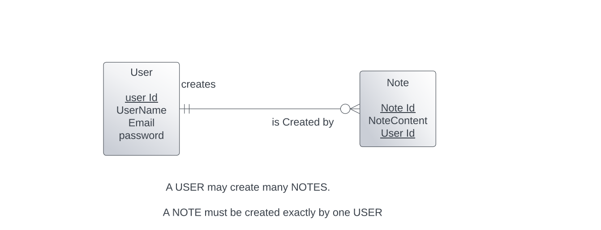

<h1>WEB PROJECT</h1>
<h2>This is my Web Assignment which contains a login page, Register page and a Note page</h2> 

A user can login or register or enter any notes. And also all the pages are linked to each other such that we can switch from one page to other pages any page can be easily. We can also get the list of all users in login page.
 

